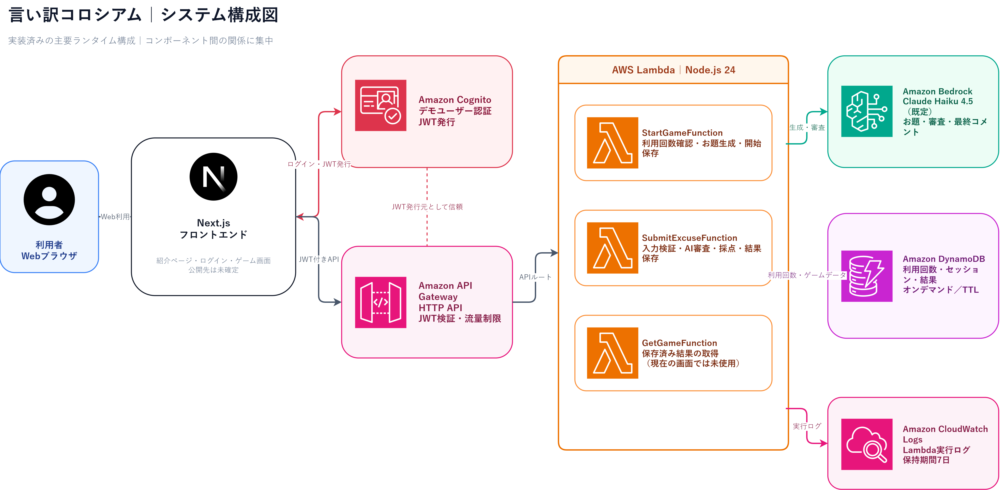

# 言い訳コロシアム

> その言い訳、AI審判団を納得させられるか。

AIが生成する理不尽なお題に対して、プレイヤーが自分の言葉で弁明し、3人のAI審査員から評価を受ける1人用テキストゲームです。

AWSとAmazon Bedrockを実際に使って生成AIアプリケーションの処理構成を学ぶことを目的に開発しました。本リポジトリは現在のテキストゲームを完成スコープとし、追加機能の拡張は予定していません。

## ゲームの流れ

1. Amazon Bedrockがお題を生成する
2. プレイヤーが最大600文字で言い訳を入力する
3. 検察官AI・弁護人AI・民衆AIが、それぞれの立場から並列で評価する
4. 5つの評価軸を集計し、Amazon Bedrockが最終コメントを生成する
5. 100点満点のスコアとS〜E／EXランクを画面に表示する

評価軸は、説得力・面白さ・誠実さ・リスク回避力・整合性の5つです。

## 公開構成

- `/`：ログインなしで閲覧できる作品紹介ページ
- `/game`：Amazon Cognitoによるログインが必要なゲーム画面
- Cognitoの自己登録は無効
- 管理者が作成した1つのデモアカウントだけを使用
- フロントエンドの公開先は未確定（Cloudflareを候補として検討中）

ゲームを操作できる利用者を限定し、公開URLから第三者がAmazon Bedrockを無制限に呼び出せない構成にしています。

## システム構成



処理の基本経路は次のとおりです。

```text
ブラウザ
  ├─ Amazon Cognito（ログイン・JWT発行）
  └─ Amazon API Gateway（JWT検証・流量制限）
       └─ AWS Lambda
            ├─ Amazon Bedrock（お題・審査・最終コメントの生成）
            ├─ Amazon DynamoDB（セッション・結果・日次利用回数）
            └─ Amazon CloudWatch Logs（実行ログ）
```

詳しい構成は[アーキテクチャ資料](./docs/architecture/README.md)を参照してください。現在の実装に対応したシステム構成図と、通常成功経路に限定した1ゲームの処理フロー図を掲載しています。

## 使用技術

| 分類 | 技術 | 役割 |
| --- | --- | --- |
| Frontend | Next.js 16 / React 18 / TypeScript | 紹介ページ、ログイン、ゲーム画面 |
| Authentication | Amazon Cognito | デモアカウントの認証とJWT発行 |
| API | Amazon API Gateway HTTP API | JWT検証、API受付、流量制限 |
| Compute | AWS Lambda / Node.js 24 | ゲーム開始、審査、結果取得 |
| Generative AI | Amazon Bedrock / Claude Haiku 4.5 | お題、審査コメント、最終コメントの生成 |
| Database | Amazon DynamoDB | ゲームデータと日次利用回数の保存 |
| Monitoring | Amazon CloudWatch Logs | Lambdaの実行ログ保存 |
| Infrastructure as Code | AWS SAM / AWS CloudFormation | AWSリソースの定義とデプロイ |
| Test | Vitest | ゲーム処理、API、保存処理、利用回数制限のテスト |

役割の詳細は[技術スタック](./docs/architecture/TECH_STACK.md)にまとめています。

## セキュリティ・料金対策

- Cognito User Poolは管理者によるユーザー作成だけを許可
- API Gatewayの全ゲームAPIにJWT Authorizerを設定
- API Gatewayは1秒あたり2リクエスト、バースト5に制限
- 共有デモアカウントは日本時間の1日あたり20ゲームまで
- 言い訳の入力は最大600文字
- DynamoDBはオンデマンド課金
- ゲームデータは作成から24時間後にTTLで自動削除
- CloudWatch Logsの保持期間は7日
- 生成AIのJSONが不正な場合だけ1回再試行
- 1ゲームのBedrock呼び出しは通常5回、再試行を含む最大10回

AWS Budgetsの通知はAWSアカウント側で設定し、想定外の利用料金を検知できるようにしています。

## ローカルで確認する

### 必要なもの

- Node.js 24
- npm

### 起動手順

```bash
npm install
```

`.env.example` を `.env.local` にコピーします。初期値はMock AIとメモリ保存なので、AWS認証情報や利用料金なしで確認できます。

```bash
npm run dev
```

[http://localhost:3000](http://localhost:3000)をブラウザで開きます。

AWSへ接続して確認する場合は、SAMデプロイ後のAPI URL、Cognito App Client ID、AWSリージョンを公開環境変数へ設定します。

| 環境変数 | 用途 |
| --- | --- |
| `NEXT_PUBLIC_API_BASE_URL` | API GatewayのURL |
| `NEXT_PUBLIC_COGNITO_CLIENT_ID` | Cognito App Client ID |
| `NEXT_PUBLIC_AWS_REGION` | Cognitoを作成したAWSリージョン |
| `AI_PROVIDER` | `mock` または `bedrock` |
| `STORAGE_PROVIDER` | `memory` または `dynamodb` |
| `BEDROCK_MODEL_ID` | Amazon Bedrockで使用するモデルID |
| `GAME_SESSIONS_TABLE` | DynamoDBテーブル名 |
| `PLAY_LOG_TTL_DAYS` | ゲームデータの保持日数 |
| `PLAY_LIMIT_PER_DAY` | 1ユーザーの日次ゲーム上限 |

`.env.local`、AWS認証情報、パスワードなどの秘密情報はGitへコミットしません。

## 検証コマンド

```bash
npm run lint
npm test
npm run build
npm run sam:validate
npm run sam:build
```

現在の自動テストは5ファイル・15件です。Amazon BedrockとDynamoDBはMockを使用し、通常のテストでAWS料金が発生しないようにしています。

## AWSへデプロイする

AWS CLIとAWS SAM CLIを設定したうえで、次を実行します。

```bash
npm run sam:validate
npm run sam:build
sam deploy --guided
```

初回デプロイでは主に次の値を指定します。

- `BedrockModelId`：使用するAmazon BedrockのモデルID
- `FrontendOrigin`：APIの呼び出しを許可するフロントエンドURL

デプロイ後は、SAMの出力値にあるAPI URL、Cognito App Client ID、AWSリージョンをフロントエンドへ設定します。Cognitoのユーザーは管理者が作成し、自己登録は開放しません。

## ディレクトリ構成

```text
app/                    Next.jsの紹介ページ・ゲーム画面・ローカルAPI
src/                    ゲーム処理、AWS接続、Lambdaハンドラ
infra/template.yaml     AWS SAMテンプレート
tests/                  Vitestの自動テスト
docs/architecture/      アーキテクチャ資料・技術スタック
```

## 関連資料

- [アーキテクチャ資料](./docs/architecture/README.md)
- [技術スタック](./docs/architecture/TECH_STACK.md)
- [PDF作成用メモ](./docs/portfolio-pdf-materials.md)
- [AWS SAMテンプレート](./infra/template.yaml)
