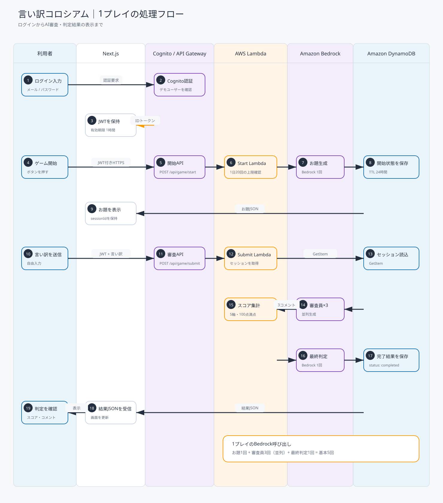

# 言い訳コロシアム｜アーキテクチャ資料

このページは、現在実装されている構成だけを対象にしています。追加機能を前提とした将来構成は含めていません。

## システム構成図

[編集可能なdraw.ioファイル](./system-architecture.drawio)

現在の実装に存在する、Next.jsのフロントエンド、Cognito、API Gateway、3つのLambda、Bedrock、DynamoDB、CloudWatch Logsだけを記載しています。

- ブラウザはCognitoへ直接ログインし、IDトークンを取得します。
- ブラウザは取得したIDトークンを付けて、API Gatewayを直接呼び出します。
- CognitoとAPI Gatewayの破線は「JWT発行元として信頼する」という論理関係です。API通信がCognitoを経由する意味ではありません。
- API GatewayからLambdaへの線は3つのAPIルートをまとめたものです。個別の呼び出し順序は処理フロー図に分離しています。
- 結果取得APIは実装済みですが、現在のゲーム画面では使用していないため、GetGameFunctionの説明内に明記しています。
- LambdaからBedrock、DynamoDB、CloudWatch Logsへの線も、3関数からの接続をまとめて示しています。
- フロントエンドの公開ホスティング先は未確定です。

## 1ゲームの処理フロー

[Mermaidソース](./game-flow.mmd)

ログイン後の「お題を受ける」から結果表示までを、次の2段階に分けています。

1. 開始APIで利用回数を確認し、Bedrockでお題を生成してDynamoDBへ開始状態を保存する
2. 採点APIでセッションを取得し、3人のAI審査、集計、最終コメント生成を行って結果を保存する

この図は通常の成功経路を説明するためのものです。認証失敗、利用上限超過、入力エラー、AWSサービスの障害、現在の画面で未使用の結果取得APIは混在させていません。

## AWS SAMテンプレート

[AWS SAMテンプレート](../../infra/template.yaml)には、現在使用する次のリソースを定義しています。

- Amazon Cognito User Pool / App Client
- Amazon API Gateway HTTP API / JWT Authorizer
- AWS Lambda 3関数
- Amazon DynamoDB
- Amazon CloudWatch Logs

`sam validate` と `sam build` はローカルの検証・配布用ファイル作成であり、それだけではAWSリソースの変更や料金発生はありません。AWSへ反映されるのは `sam deploy` を実行したときです。

## 技術スタック

各技術の役割は[技術スタック一覧](./TECH_STACK.md)にまとめています。

## ロゴ・商標

Next.jsのブランド表示は[Vercel公式ブランド素材](https://vercel.com/geist/brands)を参照しています。Next.jsおよびNext.jsロゴはVercel Inc.の商標です。
