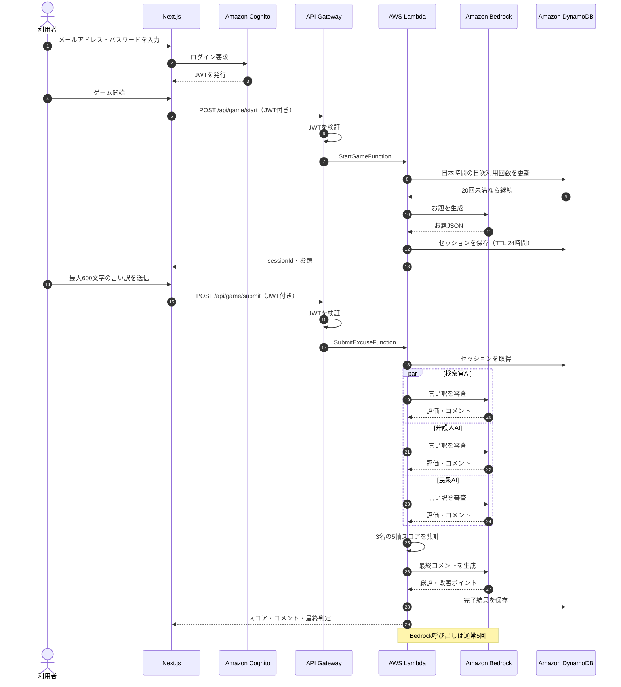

# 言い訳コロシアム｜アーキテクチャ資料

このページは、現在実装されている構成だけを対象にしています。追加機能を前提とした将来構成は含めていません。

## システム構成図

Next.jsのフロントエンドから、AWSの認証・API・Lambda・生成AI・データ保存・ログへ接続する全体像です。フロントエンドの公開ホスティング先は未確定です。


- [PNG](./system-architecture.png)：READMEやポートフォリオへの掲載用
- [SVG](./system-architecture.svg)：拡大表示用
- [draw.io](./system-architecture.drawio)：diagrams.netで編集するための元データ

## 1ゲームの処理フロー



- [Mermaidソース](./game-flow.mmd)
- [詳細フロー PNG](./game-flow.png)
- [詳細フロー SVG](./game-flow.svg)
- [詳細フロー draw.io](./game-flow.drawio)

## AWS SAMテンプレート

[AWS SAMテンプレート](../../infra/template.yaml)には、現在使用する次のリソースを定義しています。

- Amazon Cognito User Pool / App Client
- Amazon API Gateway HTTP API / JWT Authorizer
- AWS Lambda 3関数
- Amazon DynamoDB
- Amazon CloudWatch Logs

`sam validate` と `sam build` はローカルの検証・配布用ファイル作成であり、それだけではAWSリソースの変更や料金発生はありません。AWSへ反映されるのは `sam deploy` を実行したときです。

## 技術スタック

各技術の役割は[技術スタック一覧](./TECH_STACK.md)にまとめています。

## 構成図を更新する

```bash
npm run architecture:generate
```

生成元は `scripts/generate-architecture-diagrams.mjs` です。PNG・SVG・draw.ioを同時に更新します。
